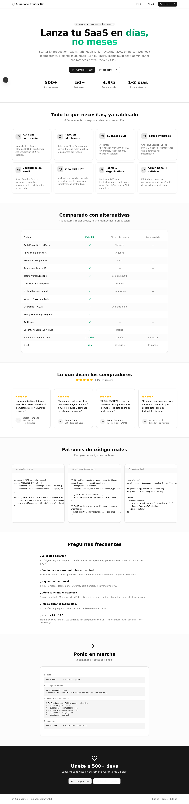
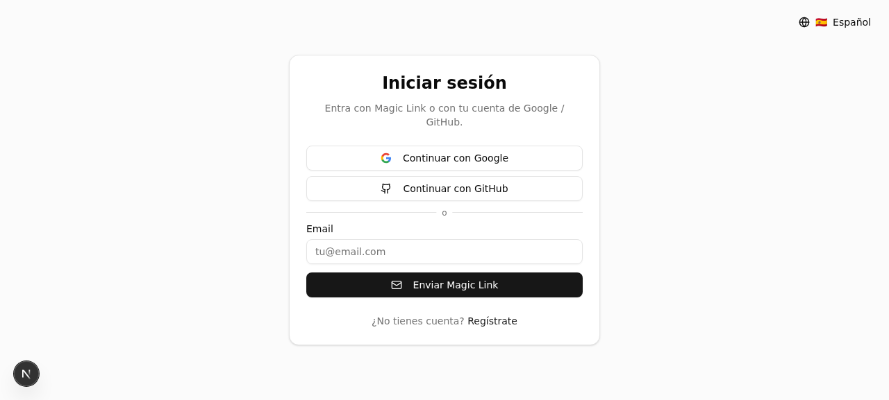
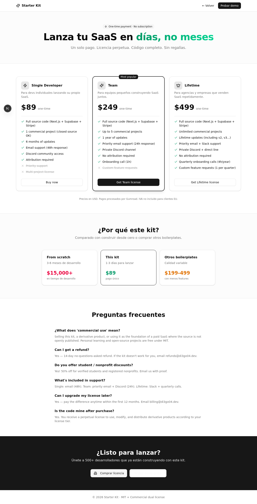
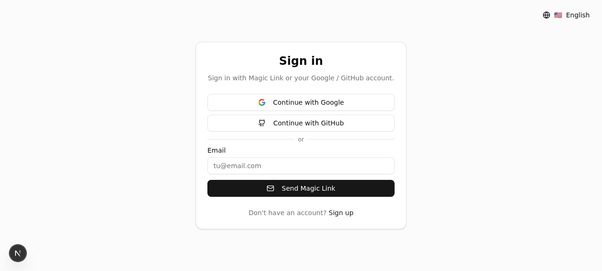
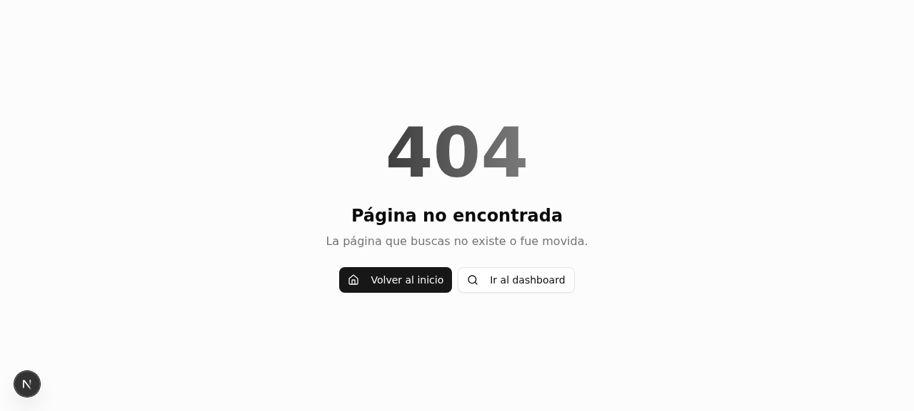

<div align="center">

# Next.js + Supabase Starter Kit

**Lanza tu SaaS en días, no meses.** Auth, RBAC, Stripe, emails, i18n, teams, admin panel, tests y deploy en 1 clic.

[](https://nextjs.org)
[](https://supabase.com)
[](https://stripe.com)
[](https://www.typescriptlang.org)
[](#)
[](./LICENSE)
[](./CHANGELOG.md)

[🛒 Comprar $89](https://gumroad.com/l/starter-kit-di3go04) · [🌟 Demo en vivo](https://starter-kit-di3go04.vercel.app) · [📚 Documentación](#) · [💬 Discord](https://discord.gg/starter-kit)

</div>

---

## 📸 Screenshots

<table>
  <tr>
    <td width="50%" align="center"><b>Landing page</b></td>
    <td width="50%" align="center"><b>Login (Magic Link + OAuth)</b></td>
  </tr>
  <tr>
    <td></td>
    <td></td>
  </tr>
  <tr>
    <td align="center"><b>Pricing — 3 planes</b></td>
    <td align="center"><b>i18n EN/ES/PT funcional</b></td>
  </tr>
  <tr>
    <td></td>
    <td></td>
  </tr>
  <tr>
    <td align="center"><b>404 page</b></td>
    <td align="center"><b>Middleware auth redirect</b></td>
  </tr>
  <tr>
    <td></td>
    <td></td>
  </tr>
</table>

---

## 🎯 Por qué este kit

Construir un SaaS desde cero toma 3-6 meses solo para tener auth + pagos + emails funcionando. Este kit te da todo eso en 1-3 días, con patrones de producción (no demos):

- ✅ **Webhook de Stripe idempotente** (la mayoría de boilerplates lo ignoran → bug de dobles emails en producción).
- ✅ **i18n ES/EN/PT realmente cableado** (otros kits anuncian i18n pero toda la UI está en inglés hardcoded).
- ✅ **Admin panel con MRR/churn** (no solo "lista de usuarios").
- ✅ **Teams/Organizations** multi-seat (la mayoría de kits a $89 no lo incluyen).
- ✅ **8 plantillas de email** (no 2-3 como otros).
- ✅ **Tests reales** (Vitest + Playwright, no solo "tests passing" en README).
- ✅ **Dockerfile multi-stage + CI/CD** (la mayoría incluyen solo Dockerfile básico).
- ✅ **Sentry + Posthog + pino logger** integrados (otros: nada).
- ✅ **Security headers** (CSP, HSTS, X-Frame-Options) en next.config.

## ⚡ Quick start

```bash
git clone https://github.com/di3go04/nextjs-supabase-starter-kit.git
cd nextjs-supabase-starter-kit
bun install
cp .env.local.example .env.local  # rellena credenciales
bun run dev
```

## 📊 Comparativa

| Feature | Este kit ($89) | Shipfa.st ($199) | Makerkit ($299) | From scratch |
|---------|:-:|:-:|:-:|:-:|
| Auth Magic Link + OAuth | ✅ | ✅ | ✅ | ❌ |
| RBAC con middleware | ✅ | ⚠️ Parcial | ✅ | ❌ |
| Webhook idempotente | ✅ | ❌ | ✅ | ❌ |
| Admin panel con MRR | ✅ | ❌ | ✅ | ❌ |
| Teams / Organizations | ✅ | ❌ | $299+ | ❌ |
| i18n ES/EN/PT | ✅ | EN only | EN only | ❌ |
| 8 plantillas React Email | ✅ | 3 | 5 | ❌ |
| Vitest + Playwright | ✅ | ❌ | ✅ | ❌ |
| Dockerfile + CI/CD | ✅ | Dockerfile | Dockerfile | ❌ |
| Sentry + Posthog | ✅ | ❌ | Sentry | ❌ |
| Audit logs | ✅ | ❌ | $299+ | ❌ |
| Security headers (CSP) | ✅ | Básico | ✅ | ❌ |
| **Tiempo hasta prod** | **1-3 días** | 1-3 días | 1-3 días | **3-6 meses** |
| **Precio** | **$89** | $199 | $299 | $15,000+ |

## 🛠️ Stack

| Capa | Tech |
|------|------|
| Framework | Next.js 16 (App Router, RSC, Server Actions, Turbopack) |
| Lenguaje | TypeScript 5 (strict mode) |
| Auth | Supabase SSR + Magic Link + OAuth (Google/GitHub) |
| DB / Storage | Supabase (Postgres + RLS + Storage) |
| Pagos | Stripe Checkout + Billing Portal + Webhooks idempotentes |
| Emails | Resend + React Email (8 plantillas) |
| i18n | next-intl (ES/EN/PT) |
| UI | Tailwind CSS 4 + shadcn/ui (45+ componentes) |
| Estado | React Query + Zustand |
| Validación | Zod |
| Tests | Vitest + Playwright + Testing Library |
| Observabilidad | Sentry + Posthog + pino |
| DevOps | Dockerfile multi-stage + GitHub Actions CI |

## 📂 Estructura

```
src/
├── app/
│   ├── (auth)/{login,register,auth/callback}     # Auth pública
│   ├── dashboard/{page,profile,billing,admin,teams}  # App privada
│   ├── pricing/                                  # Landing de venta
│   ├── api/webhooks/stripe/                      # Webhook idempotente
│   ├── actions/{auth,profile,billing,admin,teams}.ts  # Server Actions
│   ├── {error,loading,not-found,global-error,sitemap,robots,manifest}.tsx
│   └── page.tsx                                  # Landing
├── components/
│   ├── dashboard/header.tsx                      # Header con rol + switcher
│   ├── providers.tsx                             # Theme + QueryClient + Posthog
│   ├── language-switcher.tsx                     # i18n ES/EN/PT
│   └── ui/                                       # shadcn/ui
├── context/user-context.tsx                      # useUser hook
├── emails/                                       # 8 plantillas React Email
├── i18n/                                         # next-intl
├── lib/{supabase,stripe,resend,rbac,flags,logger,ratelimit,site,types}.ts
├── messages/{es,en,pt}.json                      # Traducciones
└── middleware.ts                                 # Auth + RBAC
supabase/                                          # SQL migrations
├── profiles.sql
├── subscriptions.sql
├── webhook_events.sql
├── audit_logs.sql
└── teams.sql
.github/workflows/ci.yml                          # Lint + typecheck + tests
Dockerfile                                        # Multi-stage standalone
docker-compose.yml                                # App + Redis + Stripe CLI
```

## 🔧 Setup (5 pasos)

### 1. Clonar e instalar

```bash
git clone https://github.com/di3go04/nextjs-supabase-starter-kit.git
cd nextjs-supabase-starter-kit
bun install
cp .env.local.example .env.local
```

### 2. Configurar Supabase

1. Crea proyecto en [supabase.com](https://supabase.com).
2. Copia URL + anon key + service_role a `.env.local`.
3. En SQL Editor, ejecuta en orden: `profiles.sql` → `subscriptions.sql` → `webhook_events.sql` → `audit_logs.sql` → `teams.sql`.
4. Habilita Google y GitHub en Authentication → Providers.
5. Añade `http://localhost:3000/auth/callback` a las URLs de redirección.

### 3. Configurar Stripe

1. Copia `sk_test_xxx` y `pk_test_xxx` a `.env.local`.
2. Crea productos Pro ($19) y Enterprise ($99), pega los `price_xxx`.
3. Para webhook local: `bun run stripe:listen` (copia el `whsec_xxx` a `.env.local`).

### 4. Configurar Resend

```bash
# Mientras verificas dominio, usa onboarding@resend.dev
RESEND_API_KEY=re_xxx
RESEND_FROM_EMAIL=onboarding@resend.dev
```

### 5. Run

```bash
bun run dev     # http://localhost:3000
```

## 🚀 Deploy en Vercel (1 clic)

1. Importa el repo en [vercel.com/new](https://vercel.com/new).
2. Configura todas las variables de `.env.local` en Vercel.
3. Deploy. ✅
4. En Stripe Dashboard → Webhooks, añade `https://your-app.vercel.app/api/webhooks/stripe`.
5. Copia el `whsec_` a `STRIPE_WEBHOOK_SECRET` en Vercel y redeploya.

Ver [`docs/deploy.md`](./docs/deploy.md) para guía completa.

## 🧪 Tests

```bash
bun run test           # Vitest unit (20 tests)
bun run test:e2e       # Playwright e2e
bun run test:coverage  # Coverage report
```

## 🐳 Docker

```bash
docker compose --profile dev up   # app + redis + stripe-cli
docker build -t starter-kit .     # producción
```

## 📦 Planes y precios

| Plan | Precio | Proyectos | Updates | Soporte |
|------|--------|-----------|---------|---------|
| Single Developer | $89 | 1 | 6 meses | Email 48h |
| Team (5 devs) | $249 | 5 | 1 año | Prioridad 24h + Discord |
| Lifetime | $499 | ∞ | Para siempre | Slack + calls trimestrales |

Ver [`/pricing`](https://starter-kit-di3go04.vercel.app/pricing) para detalle completo.

## 📜 Licencia

Dual license: **MIT** (uso personal/open-source) + **Commercial** (productos pagos).

Ver [`LICENSE`](./LICENSE) para detalle. Compra tu licencia en [`/pricing`](https://starter-kit-di3go04.vercel.app/pricing).

## 💬 Comunidad

- 💬 [Discord](https://discord.gg/starter-kit) — Soporte y networking
- 🐛 [Issues](https://github.com/di3go04/nextjs-supabase-starter-kit/issues) — Bugs y feature requests
- 💡 [Discussions](https://github.com/di3go04/nextjs-supabase-starter-kit/discussions) — Preguntas y feedback
- 🐦 [@your-handle](https://twitter.com/your-handle) — Updates

## 🙏 Créditos

Construido con [Next.js](https://nextjs.org), [Supabase](https://supabase.com), [Stripe](https://stripe.com), [Resend](https://resend.com), [shadcn/ui](https://ui.shadcn.com), [Tailwind CSS](https://tailwindcss.com) y mucho ☕.

---

<div align="center">

**[🛒 Comprar $89](https://gumroad.com/l/starter-kit-di3go04)** · Garantía de 14 días · Sin preguntas

Hecho con ❤️ para devs que quieren lanzar rápido.

</div>
