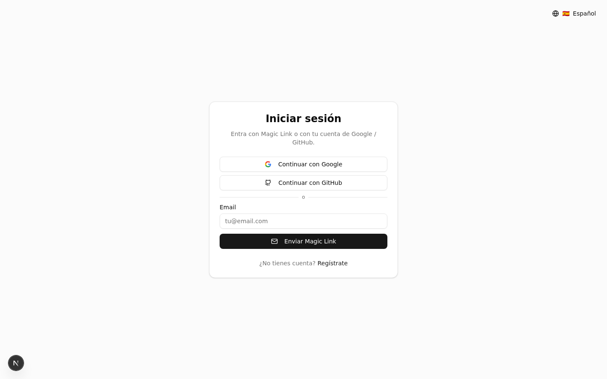
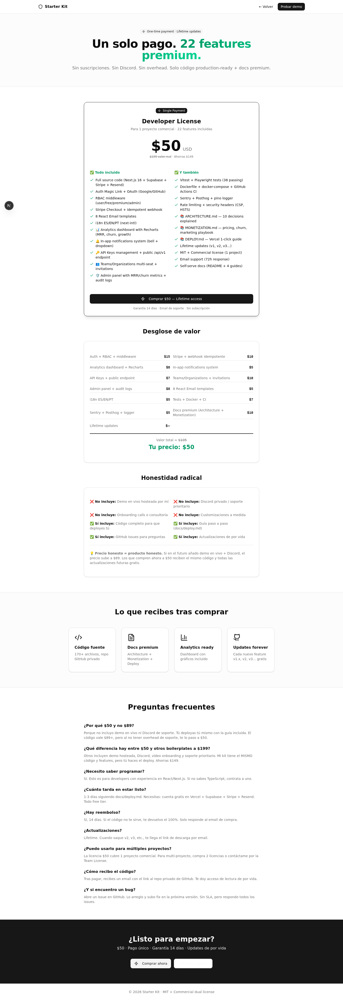
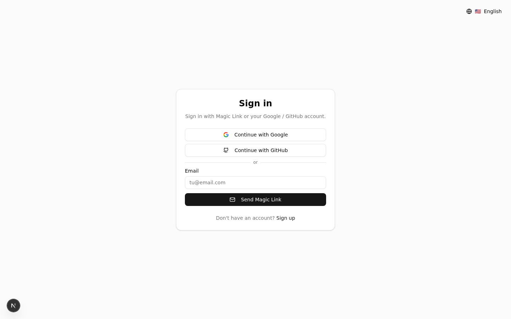

<div align="center">

# Next.js + Supabase Starter Kit

**Production-ready SaaS boilerplate.** Auth, RBAC, Stripe, emails, i18n, teams, admin panel, tests y deploy en 1 clic.

[](https://nextjs.org)
[](https://supabase.com)
[](https://stripe.com)
[](https://www.typescriptlang.org)
[](#)
[](./LICENSE)
[](./CHANGELOG.md)

</div>

---

## 📸 Screenshots

<table>
  <tr>
    <td width="50%" align="center"><b>Landing page</b></td>
    <td width="50%" align="center"><b>Login (Magic Link + OAuth)</b></td>
  </tr>
  <tr>
    <td></td>
    <td></td>
  </tr>
  <tr>
    <td align="center"><b>Pricing page</b></td>
    <td align="center"><b>i18n EN/ES/PT funcional</b></td>
  </tr>
  <tr>
    <td></td>
    <td></td>
  </tr>
</table>

---

## 🎯 Qué incluye

22 features production-ready:

### 🔐 Auth & Seguridad
- **Magic Link + OAuth** (Google/GitHub) via Supabase SSR
- **RBAC middleware** — roles user / free / premium / admin
- **Security headers** — CSP, HSTS, X-Frame-Options
- **Rate limiting** en auth endpoints (Upstash Redis)
- **Zod validation** en todas las server actions

### 💳 Billing
- **Stripe Checkout** + Billing Portal integrados
- **Webhook IDEMPOTENTE** — no double emails en reintentos de Stripe
- **Dunning flow** — manejo de `invoice.payment_failed` con emails automáticos
- **Audit logs** — registro de cambios de rol y acciones admin

### 📊 Premium features
- **Analytics dashboard** con Recharts (MRR, churn, growth, users by plan)
- **In-app notifications** — bell + dropdown + DB table
- **API Keys management** — generate/revoke + public `/api/v1/me` endpoint
- **Teams/Organizations** — multi-seat B2B con invitations por email
- **Admin panel** con MRR/churn metrics + cambio de rol inline

### 🌍 i18n
- **ES / EN / PT** realmente cableado (no scaffolding muerto)
- **Language switcher** basado en cookie
- **Emails localizados** según locale del usuario

### 📧 Emails
- **8 plantillas React Email** + Resend:
  - Welcome, Magic Link, Subscription Success
  - Payment Failed (dunning), Trial Ending, Invoice Receipt
  - Password Reset, Account Deleted

### 🧪 Quality & DevOps
- **38 tests** pasando (Vitest unit + Playwright e2e)
- **Dockerfile** multi-stage + docker-compose
- **GitHub Actions CI** — lint, typecheck, tests, build en cada PR
- **Sentry + Posthog + pino logger** integrados
- **Feature flags** con Vercel Edge Config

---

## ⚡ Quick start

```bash
git clone https://github.com/di3go04/nextjs-supabase-starter-kit.git
cd nextjs-supabase-starter-kit
bun install     # o npm install
cp .env.local.example .env.local  # rellena credenciales
bun run dev
```

---

## 🛠️ Stack

| Capa | Tech |
|------|------|
| Framework | Next.js 16 (App Router, RSC, Server Actions, Turbopack) |
| Lenguaje | TypeScript 5 (strict mode) |
| Auth | Supabase SSR + Magic Link + OAuth (Google/GitHub) |
| DB / Storage | Supabase (Postgres + RLS + Storage) |
| Pagos | Stripe Checkout + Billing Portal + Webhooks idempotentes |
| Emails | Resend + React Email (8 plantillas) |
| i18n | next-intl (ES/EN/PT) |
| UI | Tailwind CSS 4 + shadcn/ui (45+ componentes) |
| Estado | React Query + Zustand |
| Validación | Zod |
| Tests | Vitest + Playwright + Testing Library |
| Observabilidad | Sentry + Posthog + pino |
| DevOps | Dockerfile multi-stage + GitHub Actions CI |

---

## 📂 Estructura

```
src/
├── app/
│   ├── (auth)/{login,register,auth/callback}        # Auth pública
│   ├── dashboard/{page,profile,billing,admin,teams,analytics,api-keys} # App privada
│   ├── pricing/                                     # Landing de venta
│   ├── api/{webhooks/stripe,v1/me}                  # Webhooks + API pública
│   ├── actions/{auth,profile,billing,admin,teams,analytics,notifications,api-keys}.ts
│   └── {error,loading,not-found,sitemap,robots,manifest}.tsx
├── components/{dashboard,providers,language-switcher,theme-toggle,notification-bell}
├── context/user-context.tsx
├── emails/                                          # 8 plantillas React Email
├── i18n/ + messages/{es,en,pt}.json
├── lib/{supabase,stripe,resend,rbac,flags,logger,ratelimit,site,types}.ts
└── middleware.ts                                    # Auth + RBAC

supabase/                  # 9 SQL migrations
├── profiles.sql           # Tabla + RLS + triggers + bucket avatars
├── subscriptions.sql      # Sincronizada con Stripe
├── webhook_events.sql     # Idempotencia
├── audit_logs.sql         # Trazabilidad admin
├── teams.sql              # Multi-seat B2B
├── usage_events.sql       # Analytics tracking
├── notifications.sql      # In-app feed
├── api_keys.sql           # SHA-256 hashed personal tokens
└── seed.sql               # 6 usuarios demo

docs/
├── ARCHITECTURE.md        # 10 decisiones técnicas explicadas
├── MONETIZATION.md        # Playbook pricing, churn, marketing
└── deploy.md              # Guía deploy Vercel paso a paso

Dockerfile + docker-compose.yml + .github/workflows/ci.yml
tests/unit/ (38 tests) + tests/e2e/ (3 specs)
```

---

## 🔧 Setup (5 pasos · todo con free tier)

### 1. Clonar e instalar

```bash
git clone https://github.com/di3go04/nextjs-supabase-starter-kit.git
cd nextjs-supabase-starter-kit
bun install
cp .env.local.example .env.local
```

### 2. Configurar Supabase (free tier)

1. Crea proyecto en [supabase.com](https://supabase.com) (free: 500MB DB, 50k MAU).
2. Copia URL + anon key + service_role a `.env.local`.
3. En SQL Editor, ejecuta en orden:
   - `supabase/profiles.sql`
   - `supabase/subscriptions.sql`
   - `supabase/webhook_events.sql`
   - `supabase/audit_logs.sql`
   - `supabase/teams.sql`
   - `supabase/usage_events.sql`
   - `supabase/notifications.sql`
   - `supabase/api_keys.sql`
   - (opcional) `supabase/seed.sql` para datos demo
4. Habilita Google y GitHub en Authentication → Providers.
5. Añade `http://localhost:3000/auth/callback` a URLs de redirección.

### 3. Configurar Stripe (test mode gratis)

1. Copia `sk_test_xxx` y `pk_test_xxx` a `.env.local`.
2. Crea productos Pro ($19) y Enterprise ($99), pega los `price_xxx`.
3. Webhook local: `bun run stripe:listen` (copia el `whsec_xxx`).

### 4. Configurar Resend (3.000 emails/mes gratis)

```bash
RESEND_API_KEY=re_xxx
RESEND_FROM_EMAIL=onboarding@resend.dev  # mientras verificas dominio
```

### 5. Run

```bash
bun run dev     # http://localhost:3000
```

---

## 🚀 Deploy en Vercel (free tier)

Ver [`docs/deploy.md`](./docs/deploy.md) para guía paso a paso.

**Costos**: Vercel free + Supabase free + Stripe (solo comisiones) + Resend free = **$0/mes** hasta que tengas tráfico real.

---

## 🧪 Tests

```bash
bun run test           # Vitest unit (38 tests)
bun run test:e2e       # Playwright e2e
bun run test:coverage  # Coverage report
bun run typecheck      # TypeScript strict
bun run lint           # ESLint
```

---

## 🐳 Docker

```bash
docker compose --profile dev up   # app + redis + stripe-cli
docker build -t starter-kit .     # producción
```

---

## 📚 Documentación incluida

- [`docs/ARCHITECTURE.md`](./docs/ARCHITECTURE.md) — 10 decisiones técnicas explicadas (por qué Supabase SSR, por qué `getUser()` no `getSession()`, etc.)
- [`docs/MONETIZATION.md`](./docs/MONETIZATION.md) — Playbook de pricing, churn, marketing channels
- [`docs/deploy.md`](./docs/deploy.md) — Guía deploy Vercel paso a paso
- [`CHANGELOG.md`](./CHANGELOG.md) — Historial de versiones
- [`ROADMAP.md`](./ROADMAP.md) — Hoja de ruta pública

---

## 📜 License

Dual license: **MIT** (uso personal/open-source) + **Commercial** (productos pagos).

Ver [`LICENSE`](./LICENSE) para detalle.

---

## 💬 Support

- 🐛 [GitHub Issues](https://github.com/di3go04/nextjs-supabase-starter-kit/issues) — Bugs y feature requests
- 💡 [GitHub Discussions](https://github.com/di3go04/nextjs-supabase-starter-kit/discussions) — Preguntas técnicas
